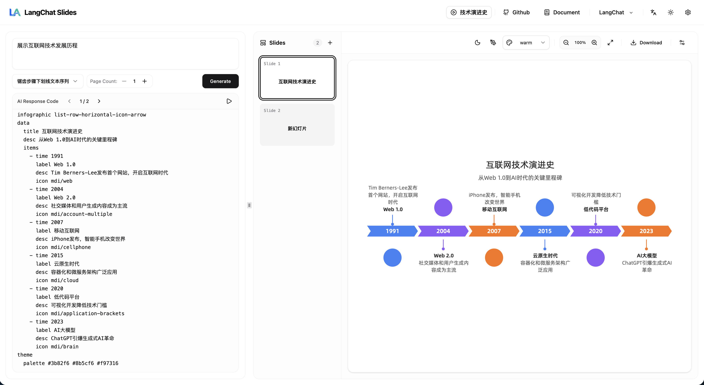

# AI PPT

<div align="center">

**AI PPT** 是一款基于生成式 AI 的智能幻灯片生成工具，由 LangChat 团队开发。


</div>


## 🎯 产品功能



### 🎨 核心能力

- **🤖 AI 驱动生成**：通过自然语言描述即时生成专业幻灯片
- **⚡ 实时流式生成**：所见即所得，AI 思考的同时幻灯片即刻渲染
- **🎯 智能布局**：基于声明式可视化语法，自动适配最佳排版，告别繁琐的 PPT 拖拽
- **💬 对话式编辑**：通过与 AI 对话进行优化——"把标题改成红色"或"增加一个时间轴"
- **📄 多页支持**：生成多张幻灯片，支持缩略图导航
- **🎨 丰富模板**：30+ 内置信息图模板（时间轴、图表、列表等）
- **🌐 主题定制**：支持浅色/深色模式，多种配色方案
- **📤 便捷导出**：一键导出为 PDF、PNG、SVG、JPG、WebP 或 PPT

### 🎨 视觉体验

- **现代 UI**：基于 Shadcn UI 和 Tailwind CSS 构建，界面简洁、精致、极致体验
- **响应式布局**：完美适配不同屏幕尺寸
- **实时预览**：输入或调整时即时反馈
- **代码编辑器**：直接查看和编辑幻灯片语法，实时渲染

### 🧠 AI 智能化

- **智能理解**：将自然语言解读为合适的布局
- **流式响应**：AI 思考和生成时实时更新内容
- **Markdown 兼容**：自动处理带 markdown 代码块的 AI 响应
- **多模型支持**：兼容 OpenAI GPT-4、GPT-3.5 等模型

### 🛠️ 高级功能

- **替换/追加模式**：选择替换或追加新幻灯片
- **自定义幻灯片**：使用信息图语法手动创建幻灯片
- **幻灯片管理**：添加空白幻灯片、清空所有幻灯片、切换页面
- **缩放控制**：画布缩放范围从 50% 到 250%
- **快捷键支持**：高效的工作流程
- **国际化支持**：内置中文和英文语言选项

---

## 🏗️ 项目架构

### 整体架构

```
┌─────────────────────────────────────────────────────────────┐
│                     AI PPT                        │
│                   (Vue 3 + TypeScript)                    │
├─────────────────────────────────────────────────────────────┤
│  UI 层                                                    │
│  ├── App.vue (主容器)                                   │
│  ├── 布局组件                                             │
│  │   ├── Header (导航与设置)                              │
│  │   └── ResizablePanel (分屏视图)                        │
│  │       ├── 左侧面板 (输入与代码)                         │
│  │       │   ├── ControlBar (主题与页码控制)               │
│  │       │   ├── PromptInput (聊天输入)                    │
│  │       │   ├── ExampleGenerator (快速模板)               │
│  │       │   └── CodeEditor (语法编辑器)                │
│  │       └── 右侧面板 (预览与导航)                      │
│  │           ├── SlidesContainer                             │
│  │           │   ├── SlideThumbnail (页面导航)              │
│  │           │   └── SlidesCanvas                           │
│  │           │       ├── SlidesHeader (工具栏)              │
│  │           │       └── SlidePreview (画布)              │
│  │           └── SlideWelcome (空状态)                       │
│  └── 对话框组件                                          │
│      ├── SettingsDialog (API 配置)                        │
│      └── CustomSlideDialog (手动输入)                     │
├─────────────────────────────────────────────────────────────┤
│  业务逻辑层                                                │
│  ├── useSlideGenerator (幻灯片生成逻辑)                 │
│  │   ├── 流式响应处理                                   │
│  │   ├── Markdown 清理                                    │
│  │   └── 多页生成                                        │
│  └── useI18n (国际化)                                     │
├─────────────────────────────────────────────────────────────┤
│  状态管理 (Pinia Store)                                     │
│  └── useAppStore                                           │
│      ├── 幻灯片状态 (slides[], currentIndex)               │
│      ├── 主题状态 (dark/light, palette, sketch)             │
│      ├── API 配置 (apiKey, baseUrl, model)                │
│      ├── UI 状态 (isStreaming, canvasScale)                 │
│      └── 导出状态 (exportRequest)                        │
├─────────────────────────────────────────────────────────────┤
│  集成层                                                   │
│  ├── useAI (OpenAI API 集成)                           │
│  │   ├── 流式聊天 (实时)                                 │
│  │   └── 错误处理                                        │
│  └── @antv/infographic (可视化引擎)                      │
│      ├── 幻灯片渲染                                      │
│      ├── 主题应用                                        │
│      └── 导出 (PNG/SVG/PDF)                              │
├─────────────────────────────────────────────────────────────┤
│  工具层                                                    │
│  ├── slide-utils.ts (模板管理)                           │
│  └── utils.ts (辅助函数)                                 │
└─────────────────────────────────────────────────────────────┘
```

### 数据流

```
用户输入 (提示词)
       ↓
┌─────────────────────────────────────────┐
│ 1. 输入处理                    │
│    - 捕获提示词                  │
│    - 选择主题和页码              │
│    - 配置 AI 模型               │
└─────────────────────────────────────────┘
       ↓
┌─────────────────────────────────────────┐
│ 2. AI 请求 (流式)               │
│    - 发送到 OpenAI API           │
│    - 实时接收数据块             │
│    - 清理 markdown 代码块         │
└─────────────────────────────────────────┘
       ↓
┌─────────────────────────────────────────┐
│ 3. 内容解析                     │
│    - 提取信息图语法             │
│    - 验证结构                   │
│    - 创建幻灯片对象             │
└─────────────────────────────────────────┘
       ↓
┌─────────────────────────────────────────┐
│ 4. 状态更新 (Pinia)             │
│    - 更新幻灯片数组             │
│    - 设置当前幻灯片索引          │
│    - 触发响应式更新             │
└─────────────────────────────────────────┘
       ↓
┌─────────────────────────────────────────┐
│ 5. 实时渲染                     │
│    - 更新 CodeEditor (左侧)      │
│    - 更新 SlidePreview (右侧)    │
│    - 检查语法完整性           │
│    - 使用 @antv/infographic 渲染│
└─────────────────────────────────────────┘
       ↓
┌─────────────────────────────────────────┐
│ 6. 用户交互                     │
│    - 在 CodeEditor 中手动编辑     │
│    - 点击缩略图导航             │
│    - 调整主题/设置             │
│    - 触发重新渲染              │
└─────────────────────────────────────────┘
       ↓
┌─────────────────────────────────────────┐
│ 7. 导出 (可选)                  │
│    - 画布转图片 (html2canvas)  │
│    - 图片转 PDF (jspdf)           │
│    - 下载文件                    │
└─────────────────────────────────────────┘
```

---

## 📁 目录结构

```
slides/
├── docs/                           # 文档目录
│   ├── infographic-api.md           # 信息图 API 参考
│   ├── PPT_EXPORT_GUIDE.md        # 导出指南
│   ├── PRODUCT.md                 # 产品文档
│   ├── REQUIREMENTS.md            # 需求与实施方案
│   ├── slides.gif                # 演示 GIF
│   └── workflows.jpg            # 工作流图
│
├── public/                        # 静态资源
│   └── favicon.ico              # 网站图标
│
├── src/
│   ├── api/                      # API 集成层
│   │   └── ai.ts               # OpenAI API 封装（支持流式）
│   │
│   ├── assets/                   # 静态资源
│   │   └── prompts/            # AI 系统提示词
│   │       ├── prompt.md         # 英文提示词模板
│   │       └── prompt.zh-CN.md  # 中文提示词模板
│   │
│   ├── components/               # Vue 组件
│   │   ├── chat/              # 聊天相关组件（已弃用）
│   │   │   ├── ChatContainer.vue
│   │   │   ├── ChatInput.vue
│   │   │   ├── ChatMessage.vue
│   │   │   └── ChatOverlay.vue
│   │   │
│   │   ├── layout/            # 布局组件
│   │   │   ├── CustomSlideDialog.vue  # 手动幻灯片输入
│   │   │   ├── Header.vue           # 顶部导航
│   │   │   ├── SettingsDialog.vue    # API 设置
│   │   │   └── index.ts
│   │   │
│   │   ├── panel/            # 左侧面板组件
│   │   │   ├── CodeEditor.vue       # 语法代码编辑器
│   │   │   ├── ControlBar.vue       # 主题与页码控制
│   │   │   ├── PromptInput.vue      # 聊天输入
│   │   │   └── index.ts
│   │   │
│   │   ├── slides/           # 幻灯片渲染组件
│   │   │   ├── SlidePreview.vue     # 主预览画布
│   │   │   ├── SlidesCanvas.vue    # 画布容器
│   │   │   ├── SlidesContainer.vue # 幻灯片列表与缩略图
│   │   │   ├── SlidesHeader.vue    # 工具栏（缩放、导出等）
│   │   │   ├── SlidesWelcome.vue   # 空状态
│   │   │   ├── SlideThumbnail.vue  # 页面缩略图
│   │   │   └── SlideControlPanel.vue
│   │   │
│   │   ├── ui/               # Shadcn UI 组件
│   │   │   ├── avatar/
│   │   │   ├── button/
│   │   │   ├── card/
│   │   │   ├── dialog/
│   │   │   ├── dropdown-menu/
│   │   │   ├── input/
│   │   │   ├── label/
│   │   │   ├── navigation-menu/
│   │   │   ├── resizable/
│   │   │   ├── scroll-area/
│   │   │   ├── select/
│   │   │   ├── switch/
│   │   │   ├── textarea/
│   │   │   └── tooltip/
│   │   │
│   │   └── ExampleGenerator.vue  # 示例模板选择器
│   │
│   ├── composables/           # Vue 组合式函数
│   │   ├── useI18n.ts       # 国际化 Hook
│   │   └── useSlideGenerator.ts  # 幻灯片生成逻辑
│   │
│   ├── examples/              # 示例模板
│   │   ├── ExampleGenerator.vue  # 示例选择器组件
│   │   └── examples.ts      # 示例数据（16 个模板）
│   │
│   ├── lib/                  # 工具函数
│   │   ├── slide-utils.ts    # 信息图模板与工具
│   │   └── utils.ts         # 通用工具
│   │
│   ├── locales/             # 国际化翻译
│   │   ├── en.json         # 英文翻译
│   │   └── zh.json         # 中文翻译
│   │
│   ├── stores/              # Pinia 状态管理
│   │   └── useAppStore.ts  # 主应用状态
│   │
│   ├── types/               # TypeScript 类型定义
│   │   └── index.ts        # 共享类型
│   │
│   ├── App.vue              # 根组件
│   ├── env.d.ts            # 环境变量类型
│   ├── main.ts             # 应用入口
│   └── style.css           # 全局样式
│
├── components.json         # Shadcn UI 配置
├── Dockerfile            # Docker 构建配置
├── docker-compose.yml    # Docker Compose 配置
├── index.html           # HTML 入口
├── LICENSE              # Apache 2.0 许可证
├── package.json         # 依赖与脚本
├── pnpm-lock.yaml      # 锁文件
├── README.md          # 英文文档
├── README_CN.md       # 本文件（中文文档）
├── tsconfig.app.json   # TypeScript 配置（应用）
├── tsconfig.json      # TypeScript 配置（基础）
├── tsconfig.node.json # TypeScript 配置（Node）
├── vite.config.d.ts   # Vite 类型
└── vite.config.mts    # Vite 构建配置
```

---

## 🛠️ 技术栈

### 前端框架
- **Vue 3**：渐进式 JavaScript 框架，使用组合式 API
- **TypeScript**：类型安全的开发体验
- **Vite 7**：下一代前端构建工具

### UI 与样式
- **Tailwind CSS v4**：实用优先的 CSS 框架，快速 UI 开发
- **Shadcn Vue**：美观、可访问、可定制的 UI 组件
- **Lucide Vue Next**：现代图标库

### 状态管理
- **Pinia**：直观、类型安全、灵活的 Vue 状态管理

### 可视化引擎
- **@antv/infographic**：强大的信息图可视化库
  - 30+ 内置信息图模板
  - 实时渲染和编辑
  - 导出为 PNG、SVG、PDF
  - 支持主题和配色方案

### AI 集成
- **OpenAI API**：前端直接集成
  - 流式响应（服务器推送事件）
  - 支持 GPT-4、GPT-3.5-turbo
  - 可自定义模型选择
  - Markdown 代码块处理

### 导出功能
- **html2canvas**：将 DOM 转换为画布
- **jspdf**：从图片生成 PDF
- **PptxGenJS**：生成 PowerPoint 文件

### 开发工具
- **ESLint**：代码质量和风格检查
- **TypeScript 严格模式**：增强类型安全
- **pnpm**：快速、节省磁盘空间的包管理器

---

## 🚀 快速开始

### 环境要求

- Node.js >= 20.x
- pnpm >= 8.x
- OpenAI API Key（或兼容的 API）

### 本地开发

1. **克隆仓库**
   ```bash
   git clone https://github.com/LangChat/langchat-slides.git
   cd langchat-slides
   ```

2. **安装依赖**
   ```bash
   pnpm install
   ```

3. **配置环境变量**
   ```bash
   cp .env.example .env
   # 编辑 .env 文件，添加你的 OpenAI API Key
   ```

4. **启动开发服务器**
   ```bash
   pnpm dev
   ```

   访问 `http://localhost:5173`

5. **构建生产版本**
   ```bash
   pnpm build
   ```

### Docker 部署

#### 使用 Docker Compose（推荐）

```bash
# 克隆并配置
git clone https://github.com/LangChat/langchat-slides.git
cd langchat-slides
cp .env.example .env
# 使用你的 API Key 编辑 .env

# 构建并启动
docker-compose up -d

# 查看日志
docker-compose logs -f

# 停止服务
docker-compose down
```

#### 直接使用 Docker

```bash
# 构建镜像
docker build -t langchat-slides .

# 运行容器
docker run -d \
  --name langchat-slides \
  -p 5173:5173 \
  -e VITE_OPENAI_API_KEY=your-api-key \
  langchat-slides
```

---

## 🌐 环境变量配置

在项目根目录创建 `.env` 文件：

```env
# OpenAI 配置
VITE_OPENAI_API_KEY=sk-your-api-key-here
VITE_OPENAI_BASE_URL=https://api.openai.com/v1
VITE_OPENAI_MODEL=gpt-4o

# 应用配置
VITE_DEFAULT_LOCALE=zh
VITE_APP_THEME=auto
```

---

## 📖 使用指南

### 创建幻灯片

1. **描述你的需求**：用自然语言输入幻灯片需求
   - 示例："创建一个展示 1950 年到 2024 年 AI 发展历史的时间轴"
   - 示例："为科技初创公司生成一个 SWOT 分析"

2. **选择模板**：从 30+ 信息图模板中选择（时间轴、图表、列表等）

3. **设置页码**：指定要生成多少页（1-10）

4. **实时生成**：看着 AI 实时生成并渲染幻灯片

5. **手动编辑**：在代码编辑器中直接编辑信息图语法

6. **导出**：点击导出按钮下载为 PDF、PNG、SVG、JPG、WebP 或 PPT

### 高级功能

**对话式编辑**
- "把主题颜色改成蓝色"
- "增加更多关于机器学习的细节"
- "把时间轴改成横向"

**手动幻灯片**
- 点击"自定义幻灯片"手动输入信息图语法
- 支持所有 @antv/infographic 模板

**幻灯片管理**
- 点击"+"添加空白幻灯片
- 点击缩略图在页面间导航
- 使用工具栏清空所有幻灯片或切换替换/追加模式

---

## 🎯 适用场景

- **📊 商务演示**：为会议和报告快速生成幻灯片
- **📚 教育培训**：将复杂概念转化为可视化时间轴和层级图
- **📈 数据可视化**：以吸引人的信息图格式展示结构化数据
- **🎨 创意设计**：快速原型制作和想法可视化
- **📝 文档制作**：创建可视化的文档和指南
- **💼 市场营销**：生成宣传材料和演示文稿

---
